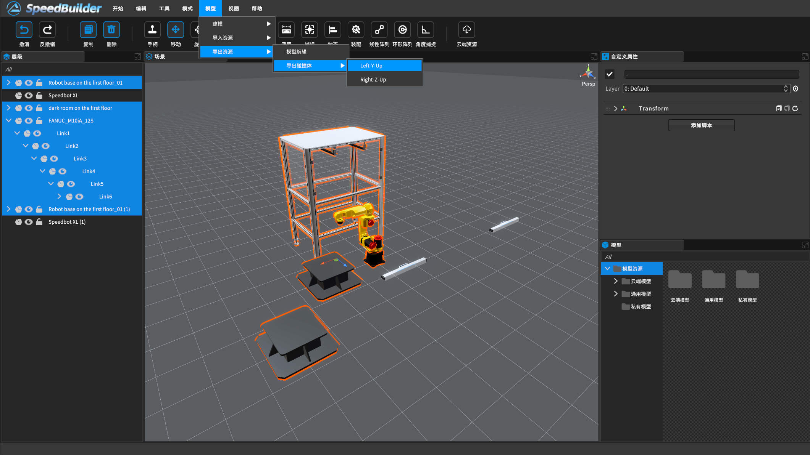

[TOC]

# 0 概述

内置碰撞体导出是将内置的碰撞体数据转化为其他格式或文件的过程，以便在其他软件或平台上进行使用。碰撞体是用于模拟物体之间碰撞和交互的关键元素，它定义了物体的形状和碰撞属性，使得在外部工具中可以进行更加复杂的碰撞检测、物理模拟或可视化分析操作。

# 1 以机器人为坐标系原点导出

<video src="https://gitlab.com/MrVBian/Introduction/-/raw/70a5fe3b21ed9c633ef8f36a10735b50648f77ab/%E7%A2%B0%E6%92%9E%E4%BD%93%E5%AF%BC%E5%87%BA.mp4" style="width: 100%; height: 100%;" controls="controls"></video>

- center：感知球体中心点
- diameter：球体直径
- coordinate：导出方式，Right_Z_up(右手系Z朝上),Left_Y_up(左手系Y朝上)

# 2 世界坐标系导出

步骤如下：
1. 选中N个要导出的模型；
2. 菜单栏 - 模型 - 导出资源 - 导出碰撞体
2.1 Left-Y-Up左手系Y朝上
2.2 Right-Z-Up右手系Z朝上

