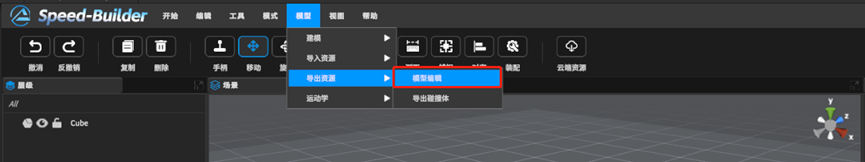
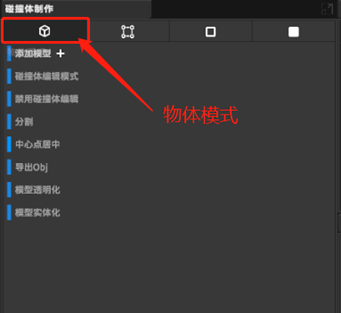
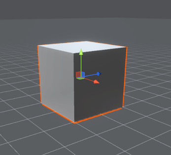
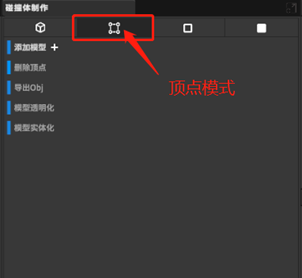
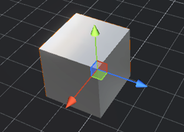
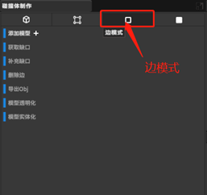
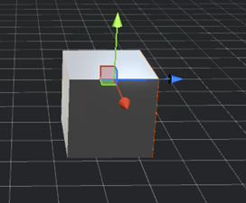
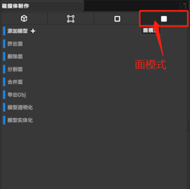
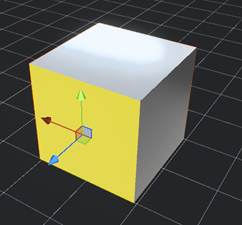

[TOC]

# 1 自定义碰撞体导出

用户可以在软件中创建相应的模型，通过添加基础模型，编辑基础模型的面、边、顶点来制作目标模型，模拟出机器人真实运动时的碰撞体模型，制作完成碰撞体模型后，可以导出OBJ类型的模型供用户使用。

# 2 进入碰撞体模式

菜单栏中“模型->导出资源->编辑模型”，选择进入模型编辑模式。

# 3 碰撞体编辑示例视频

<video src="https://gitlab.com/MrVBian/Introduction/-/raw/520355ab57c425a24c6b62d3897ef1040e24064e/20230818%E8%87%AA%E5%AE%9A%E4%B9%89%E7%A2%B0%E6%92%9E%E4%BD%93.mp4" style="width: 100%; height: 100%;" controls="controls"></video>

# 4 碰撞体模式窗口功能讲解

## 4.1 物体整体模式

==>

该模式下的具体功能介绍如下：
- 添加模型：         添加基础新模型，包括球体，立方体，拱形等模型。
- 碰撞体编辑模式： 碰撞体操作模式对物体激活。
- 禁用碰撞体编辑： 碰撞体操作模式对物体禁用。
- 分割： 将物体四等分
- 设置中心点： 模型在二次编辑后，重新设置中心点位置
- 导出OBJ：导出OBJ文件和Mat文件
- 模型透明化：模型的透明网格模式
- 模型实体化：模型的实体模式

## 4.2 顶点模式

==>

该模式下的具体功能介绍如下：
- 添加模型： 同上。
- 删除顶点: 删除顶点。
- 导出OBJ:同上。
- 模型透明化:同上。
- 模型实体化:同上。

## 4.3 边模式

==>

边模式下具体功能介绍如下：
- 添加模型：同上。
- 获取缺口：找到选中的边没有面的地方。
- 补充缺口：在选中的多个边填充面。
- 删除边：删除边。
- 导出OBJ：同上。
- 模型透明化：同上。
- 模型实体化：同上。

## 4.4 面模式

==>

面模式下具体功能介绍如下：
- 添加模型：同上。
- 挤出面：在该面新建一个面进行操作。
- 删除面：删除面。
- 分割面：将选中面进行四等分。
- 合并面：将选中面合并成一个。
- 导出OBJ：同上。
- 模型透明化：同上。
- 模型实体化同上。