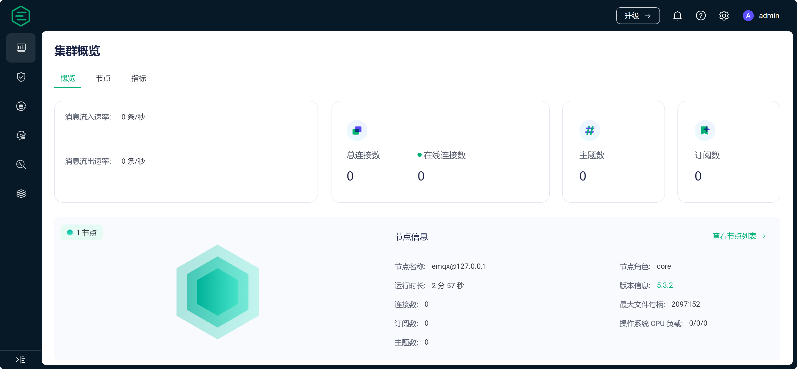

[TOC]

# 0 概述

MQTT（Message Queuing Telemetry Transport）是一种轻量级的消息传输协议，设计用于在低带宽和不稳定的网络环境中传输小型数据包。MQTT连通器是一种软件组件或设备，用于连接MQTT客户端和MQTT代理服务器（也称为MQTT代理或MQTT代理程序）之间的通信。

# 1 数字孪生模式

按照**导航栏 -> 模式 -> 数字孪生**顺序，进入数字孪生模式

需要用户输入IPv4地址，该地址为MQTT Broker的IP。若是局域网调试，请输入局域网Ip。若填入0.0.0.0则认为是127.0.0.1。

注意事项：
> 当连接成功后，软件会自动保存IP地址，待下次连接时默认填补上一次成功连接的IP地址

注意事项：

> builder软件中设备的id同MQTT Broker的topic存在映射关系，详细见设备连通性接口

注意事项：
> 若MQTT修改了默认端口，可通过修改**\SpeedBuilder_Data\StreamingAssets\MyConfig\config.json**文件中**MQTTIp**数值

# 2 数据面板

**数据面板网址：[http://localhost:18083/](http://localhost:18083/ "数据面板网址")**

- 用户名：admin
- 密码：public

# 3 设备连通性接口

详细见：[https://dt.speedbot.net/web/#/48/678](https://dt.speedbot.net/web/#/48/678 "https://dt.speedbot.net/web/#/48/678")