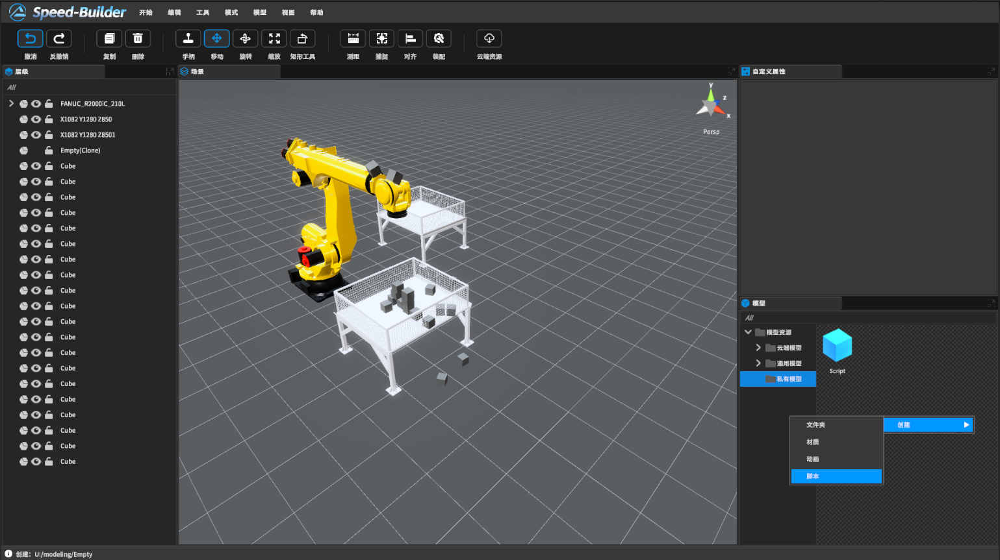
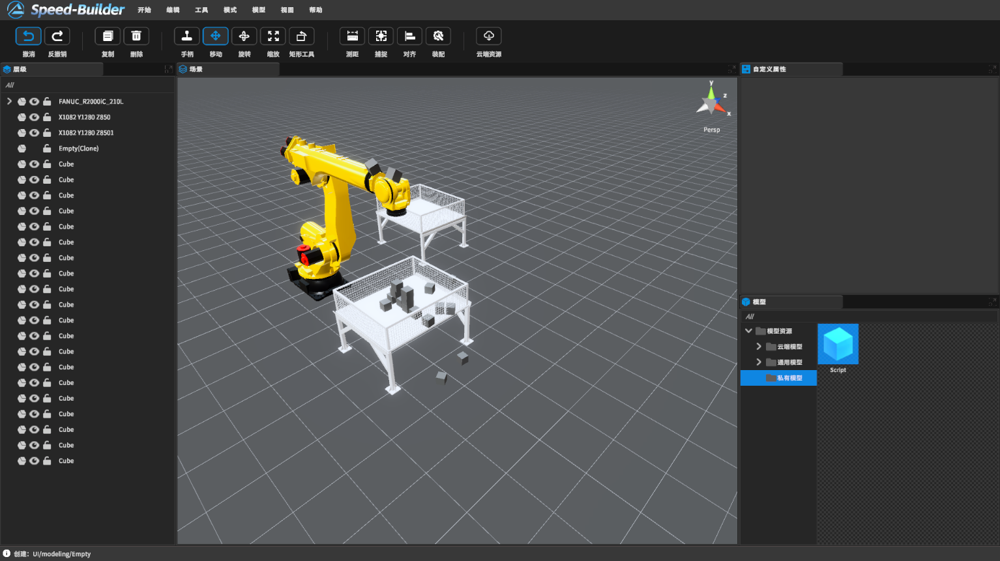
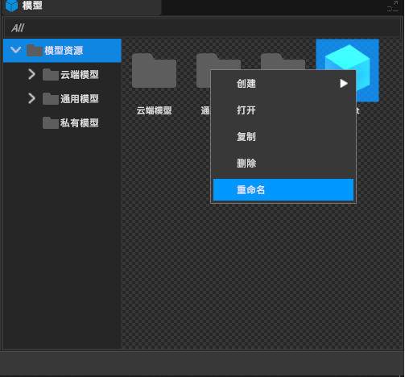
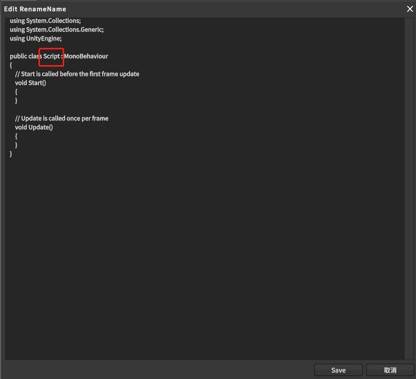
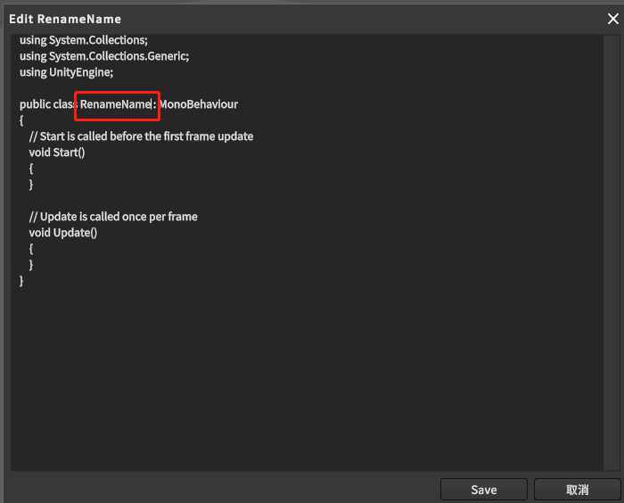
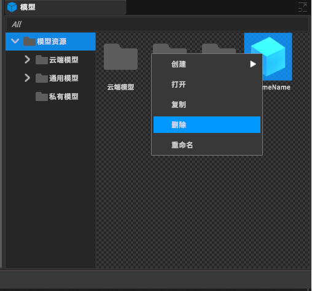
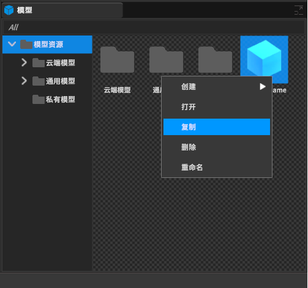
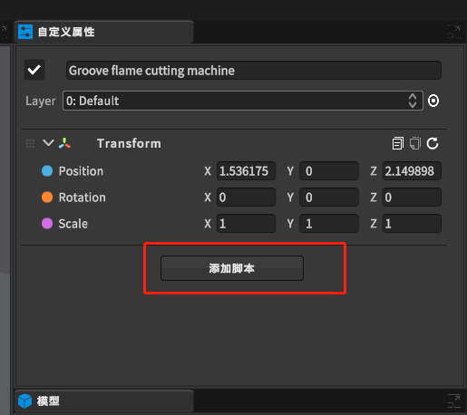
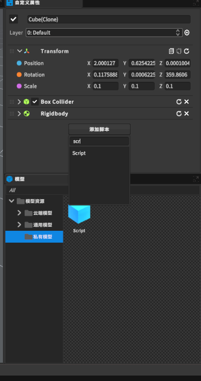

[TOC]

# 1. 创建和使用脚本
Builder里的物体的行为不需要编程可以直接控制。封装很多，用途很广泛，但是您很快就会发现，必须超封装组件可提供的功能来实现自己的功能。我们提供了允许使用__脚本__来自行创建组件。使用脚本可以触发事件，随时修改组件属性，并以所需的任何方式响应用户的输入。

软件本身支持 C# 编程语言。C#（发音为 C-sharp）是一种类似于 Java 或 C++ 的行业标准语言。


学习编程艺术以及这些特定语言的用法超出了本简介的范围。但是，许多书籍、教程和其他资源介绍了如何使用 C# 进行编程。
##  1.1创建脚本

脚本通常直接在builder创建，可以从模型界面右边文件详细窗口右键点击选择 创建 > 脚本。



左键点击脚本，builder会在该目录创建一个Script的资源文件：



##  1.2脚本文件的剖析


Start     // 使用此函数进行初始化
Update    // 每帧调用一次 ，一帧约为0.02s

```csharp
using UnityEngine;
using System.Collections;

public class Script : MonoBehaviour {

    // 使用此函数进行初始化
    void Start () {
    
    }
    
    // 每帧调用一次 Update
    void Update () {
    
    }
}
```


### 1.2.1脚本名字

脚本创建完成会有默认名字Script+序号，此时如果想更改变动名字，需右键后点击重命名



注意：右键修改完名字后脚本里并未同批修改，需要手动修改



效果如下


### 1.2.2脚本删除

右键该脚本，并点击删除按钮


### 1.2.3脚本复制

可以右键，然后点击复制或者快捷键（本软件不允许同名脚本存在）

注意，复制过后的脚本需要改名，和复制体名字一样



## 1.3控制游戏对象

将脚本实例附加到游戏对象之前，不会激活任何代码。为了附加脚本，可在属性面板中添加脚本。如下图，有个添加脚本，其中包含项目中可用的所有脚本，包括自定义的脚本。添加你想要的脚本



可以搜索你要的脚本，然后添加上去就可以运行起来你写代码

