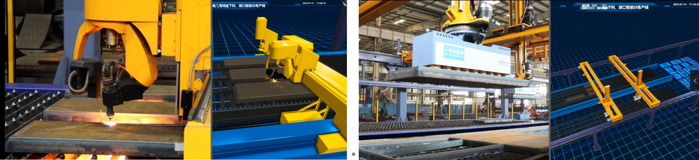
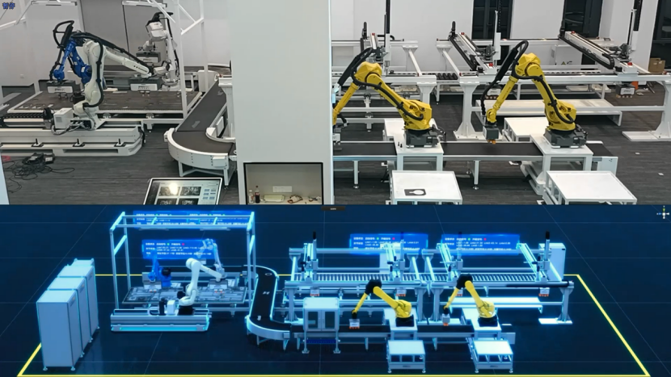

[TOC]

# 0 概述

视比特数字孪生解决方案，具有高精度和高效率模型建立和仿真能力，具有高质量数据采集和处理能力，可实时、准确的反映设备的实际运动状态，设备在数字孪生中与实际的运行状态一致。为项目现场操作人员提供更直观的体验和数据可视化，帮助理解和分析复杂的数据信息。并已在多个项目场景中应用落地。

# 1 某重工下料坡口分拣线

项目为某重工厂智能下料分拣产线，用自动化设备替代了20多位工人，实现了钢板零件的全自动柔性分拣。并通过数字化智能分栋控制系统和数字孪生系统，实现了车间智能化排产调度和全流程数据溯源，为项目高质量、高效率、高性价比的产出提供了有力保障

<video src="https://gitlab.com/MrVBian/Introduction/-/raw/0964dc9741ab06dd8726f8c89ecb28dd1ed57c30/20230615%E9%93%81%E5%BB%BA%E6%95%B0%E5%AD%97%E5%AD%AA%E7%94%9F2.mp4" controls muted width="80%" height="80%"></video>

# 2 某厂下料机加线

项目为某水机工厂产线项目，包含板材出入库、自动分拣、自动打磨、物料输送等工序流程，实现了不同规格工件的混线生产、各个工序节拍平衡，整体项目满足高自动化、高柔性化需求。数字孪生模块在项目生产运维各方面都起到了重要作用

# 3 某展厅分拣线

该展厅展示设备为某工程机械企业钢板分拣产线，完整复现了实际项目中大件桁架分拣、机器人混捡、小件二次分拣等流程。数字孪生场景与实际设备完全对应，同时清楚的展示了各个设备状态及生产数据

## 3.1 科技风格

<video src="https://gitlab.com/MrVBian/Introduction/-/raw/1c1654c8c78e1663550fc2eead9ca2016490af77/20220801%E4%B8%8A%E6%B5%B7%E5%B1%95%E5%8E%85_5x.mp4" controls muted width="80%" height="80%"></video>

## 3.2 写实风格

