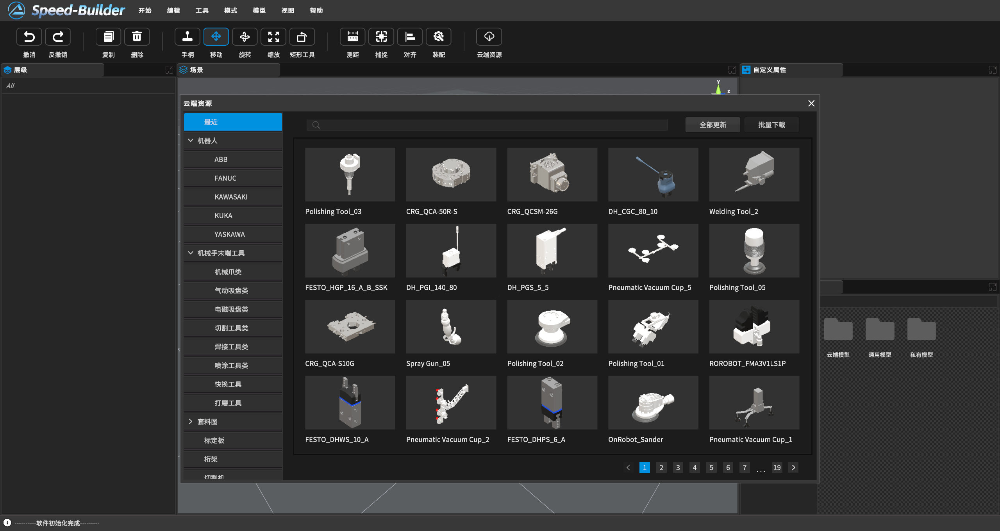
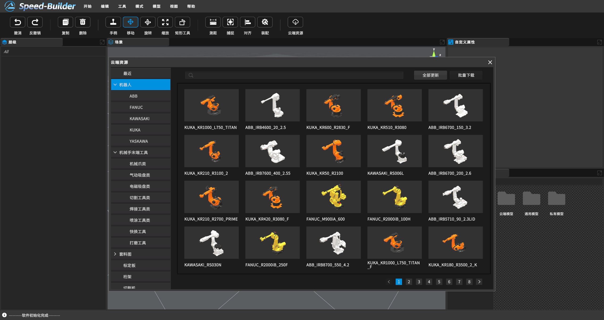
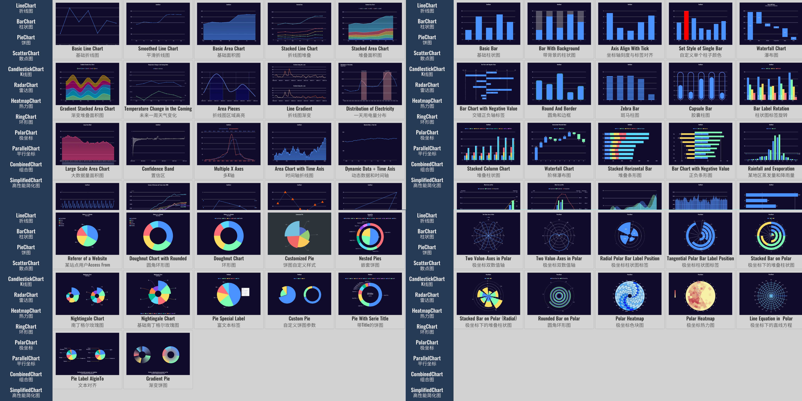
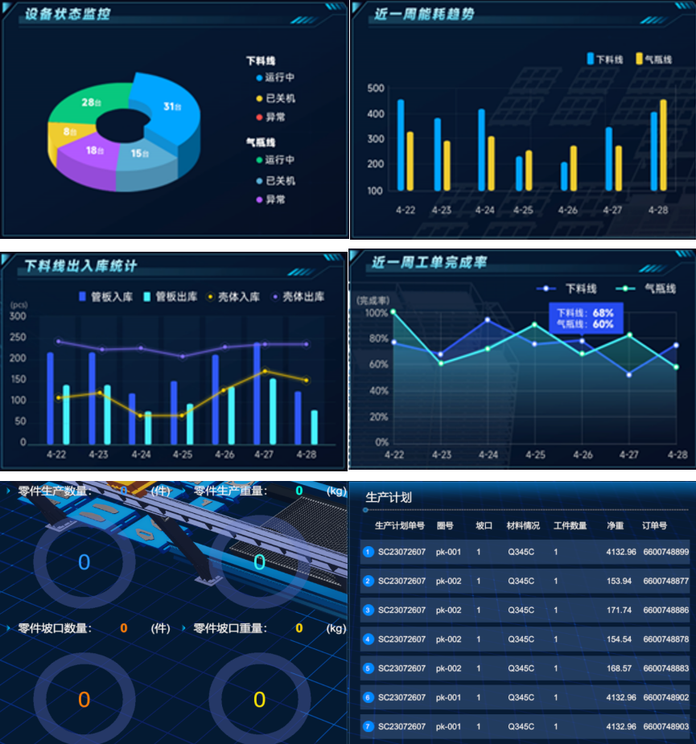
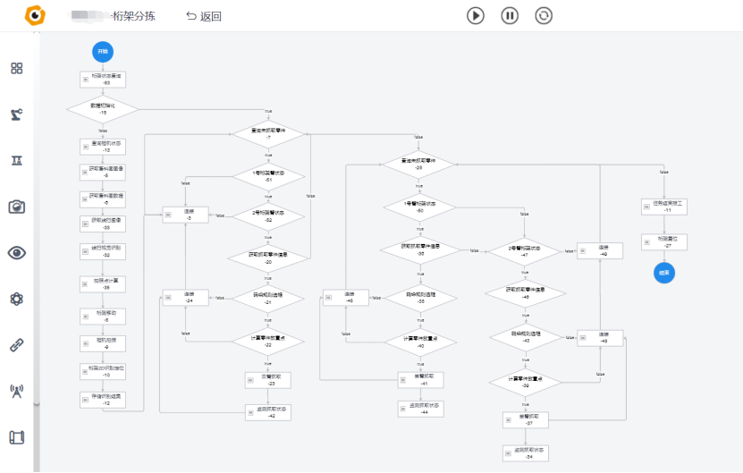

[TOC]

# 1 高精度的场景建模

得益于丰富的项目经验，数字孪生系统已经积累成百上千种工业设备模型，各类设备均按实际场景1:1建模，各类标准工业机械臂均与厂家参数完全一致。对机械臂、龙门架式行走机构等运动设备，其运动学参数也与真机完全相同，设备运行状态及动作轨迹在数字孪生系统中均与实际场景一致

详细资源见：[https://dt.speedbot.net/web/#/48/617](https://dt.speedbot.net/web/#/48/617 "https://dt.speedbot.net/web/#/48/617")

# 2 高可靠性的数据同步

数字孪生系统中，数据传输网关负责从实体物体或系统中采集数据并将其传输到数字孪生场景中。可以通过传感器、监测设备、网络等方式获取实时数据，设备需支持不同的通信协议，ModbusTCP、OPCUA、Snap7、Ethernet/Ip、MQTT。数据采集网关具有高稳定性和高并发性能，最高可达到ms级的数据实时性。可以确保数据的准确传输，保证系统运行过程中，数字孪生场景能够准确的反映实际设备的运行状态

# 3 系统数据看板

数字孪生软件内置多种数据看板模板，支持多种图表样式（饼图、柱状图、折线图、报表），可以根据客户需求快速定制。通过看板可以方便的对重要的生产数据进行可视化，丰富的图标样式能够将复杂的物理系统和数据以直观、易于理解和操作的形式呈现。可根据客户需求，将运行状态、异常信息、生产数据等以图形化、动态化的形式呈现

# 4 低代码流程编排

控制系统软件采用自研的工业低代码平台，以流程图形式进行软件程序编排，天然支持将实时运转逻辑可视化呈现，流程图节点不同的高亮状态可以指示当前系统运行进度及异常情况，可以方便工作人员快速定位问题

